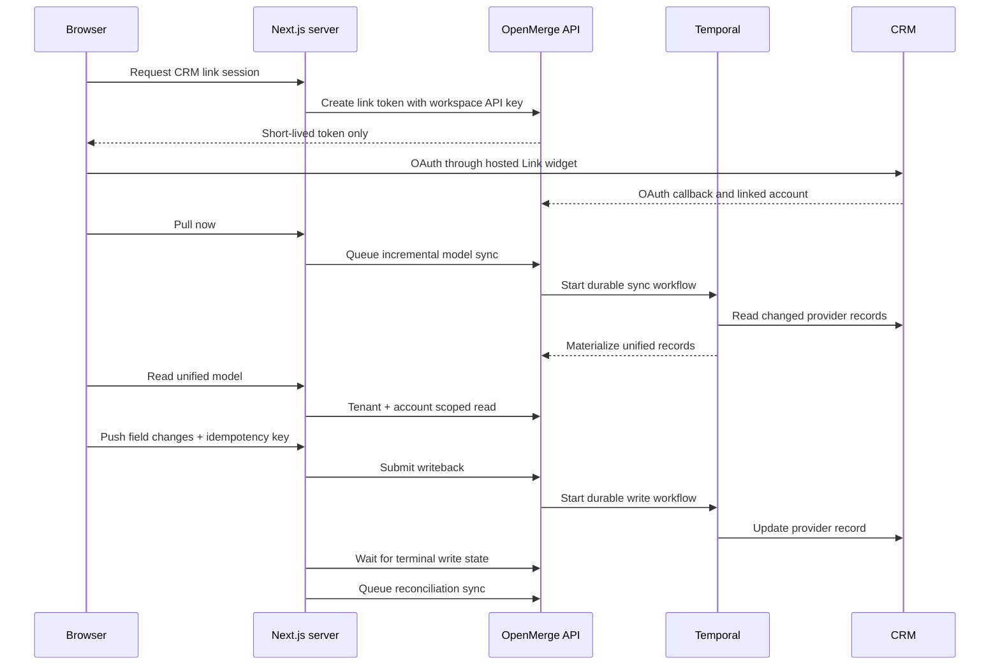

# OpenMerge Next.js CRM starter

A production-shaped customer application that exercises the public OpenMerge TypeScript SDK against HubSpot, Salesforce, Pipedrive, and Zoho CRM.

This repository is deliberately more than a visual example. It is an acceptance surface for the complete customer path:

1. Mint a short-lived, CRM-scoped Link token on the Next.js server.
2. Complete provider OAuth in the OpenMerge hosted widget.
3. List tenant-scoped linked accounts.
4. Manually queue an incremental pull sync.
5. Read the materialized unified `Contact` or `Account` model.
6. Update an existing record with an idempotent writeback.
7. Wait for a terminal provider result and queue reconciliation.

## Supported demo contract

| Provider | Unified models | Writable fields |
| --- | --- | --- |
| HubSpot | `Contact`, `Account` | Contact: first name, last name, email, phone, owner. Account: name, description, industry, website, employee count, phone, owner. |
| Salesforce | `Contact` | First name, last name, email, phone, account. |
| Pipedrive | `Contact`, `Account` | Contact: first name, last name, email, phone, account. Account: name, owner. |
| Zoho CRM | `Contact` | First name, last name, email, phone, account. |

The writeback flow updates records that have already been materialized by a pull sync. It does not pretend the current public API exposes record creation.

## Quick start

Requirements:

- Node.js 22 or newer
- a running OpenMerge deployment
- one workspace ID and workspace API key

Install and configure:

```powershell
npm install
Copy-Item .env.example .env.local
```

Populate `.env.local`:

```dotenv
OPENMERGE_API_KEY=om_...
OPENMERGE_WORKSPACE_ID=...
OPENMERGE_API_URL=https://api.openmerge.dev
NEXT_PUBLIC_OPENMERGE_EMBED_URL=https://widgets.openmerge.dev
NEXT_PUBLIC_APP_URL=http://localhost:3000
```

Run the app:

```powershell
npm run dev
```

Open [http://localhost:3000](http://localhost:3000).

The application origin must exactly match an origin allowed by the OpenMerge Link-token configuration. Provider OAuth callback URLs belong to the OpenMerge Embed deployment, not to this customer application.

## How the two-way acceptance flow works



## Server boundary

All calls authenticated with the workspace API key live under `app/api/openmerge`. The browser receives only:

- short-lived Link tokens;
- linked-account metadata;
- unified records authorized for this workspace;
- accepted sync runs and terminal writeback results.

Never place `OPENMERGE_API_KEY` in a variable prefixed with `NEXT_PUBLIC_`. Never commit `.env.local`.

The demo adds several safeguards on top of the SDK:

- exact workspace scoping on every data request;
- provider/model capability checks before reads and syncs;
- provider-specific write-field allowlists;
- retry-stable idempotency keys;
- terminal writeback waiting before reporting success;
- explicit reconciliation after a successful provider update;
- upstream status, request ID, and retryability propagation without leaking credentials.

## Verification

Run the local release gate:

```powershell
npm run typecheck
npm test
npm audit --audit-level=high
npm run build
```

Browser-level acceptance requires a running OpenMerge stack and real provider developer accounts. Test at least:

- Link opens and closes without consuming a token prematurely.
- OAuth creates the expected linked account.
- `Pull now` queues the models supported by that connector.
- Unified records are readable only under the selected account.
- A writeback reaches `completed` and changes the provider record.
- Retrying the same failed browser request retains its idempotency key.
- Reconciliation returns the provider change to the materialized read model.
- Reconnect is provider-locked for accounts in `needs_reauth`.

## Deploying

Set all five environment variables in the hosting platform. Use the public HTTPS origins of the OpenMerge API, Embed app, and this Next.js application. Keep the two server-only variables out of client build logs and browser configuration.

The app is compatible with any Node-capable Next.js host. `npm run build && npm start` is the production entrypoint.